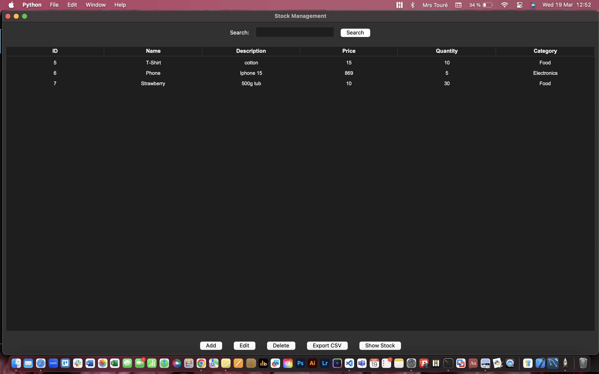

# Store Management



## Project Description

The Store Management System is a Python-based application designed to help businesses manage their inventory, sales, and customer transactions efficiently. The system provides a user-friendly interface to handle products, track stock levels, process sales, and generate reports.

## Demo

Playing the game: [Live Demo](https://www.youtube.com/watch?v=r155MhgrB8g)

## 🎮 Features

- Product Management: Add, update, and remove products from the inventory.
- Stock Tracking: Monitor stock levels and visualize them using graphical representations.
- Export to CSV: Export inventory and transaction data to a CSV file for reporting and analysis.


## Technologies and tools Used

- Python: Main programming language.
- Tkinter : GUI framework for building the application's user interface.
- MySQL: Database for storing product and transaction data.
- Matplotlib : Library for data visualization, used to display stock levels and trends.
  
## Prerequisites

Before running this project, ensure you have the following installed:

- Python 3.x
- The following Python libraries:
  - `tkinter`
  - `mysql-connector-python`
- My SQL

## Installation Steps

1. Clone this repository:
   ```bash
   git clone https://github.com/aida-niang/store_management.git
   ```
2. Install dependencies:
   ```bash
   pip install tkinter mysql-connector-python

   ```

## Usage

Run the game with:
```bash
python3 main.py
```

## Project Structure

```
📂 store-management  
├── 📁 assets/            # Images, icons, and other UI assets  
├── 📁 database/          # Database files and scripts  
├── 📁 modules/           # Python modules for different features  
│   ├── inventory.py      # Handles product and stock management  
│   ├── stock.py          # view stocks of products 
├── README.md             # Project documentation   
├── .gitignore            # Files to exclude from version control  
└── main.py               # Main application script  


```

## Detailed File Descriptions
main.py: Launches the application and connects different modules.
modules/inventory.py: Handles product management (add, update, delete).
modules/stock.py: View stocks of products 

## Contributing

This is a personal project, but I'm open to feedback and suggestions!
- [Aida NIANG](https://github.com/aida-niang/)

## License

This project is licensed under the MIT License - see the [LICENSE](LICENSE) file for details.

## Acknowledgments

Thank you to my mentors and peers for all their constructive feedback and suggestions!

## Built With

- Python 3.8
- Tkinter

## Contact

**Aida NIANG** 
- I'm in : [LinkedIn](https://linkedin.com/in/aidabenhamathniang)
- Contact me : [Email](mailto:aidam.niang@gmail.com  )
- Project Link: [Portfolio](https://aida-niang.students-laplateforme.io)

